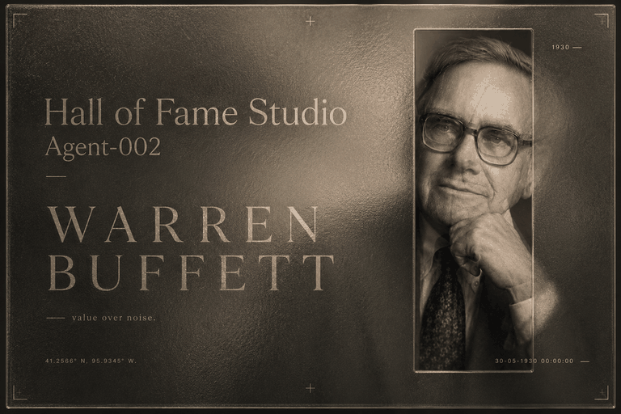
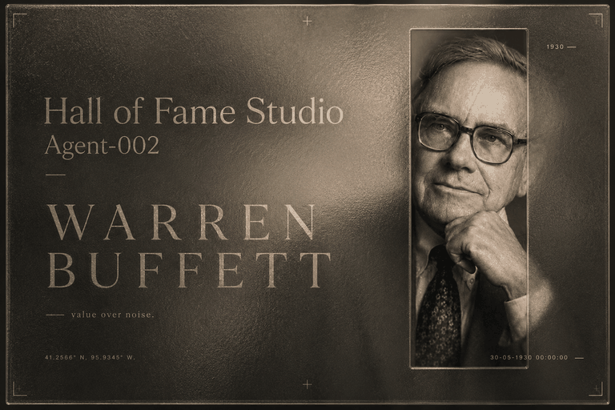
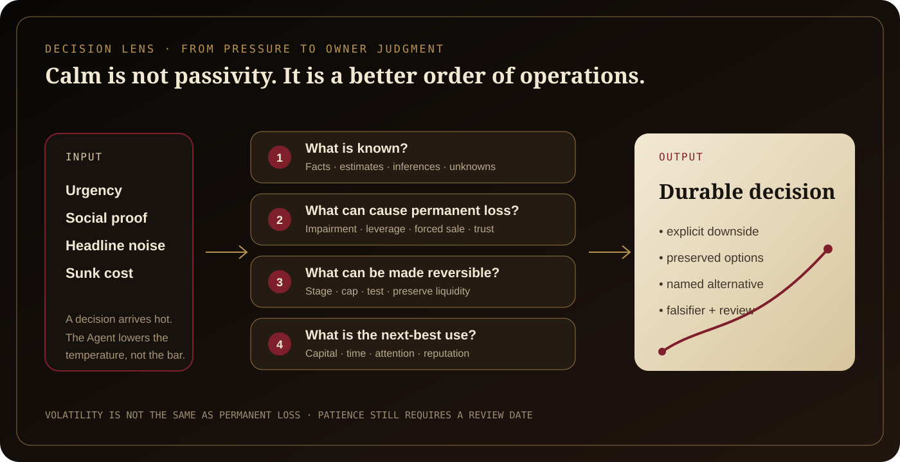
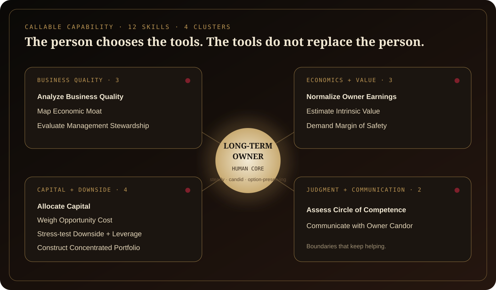
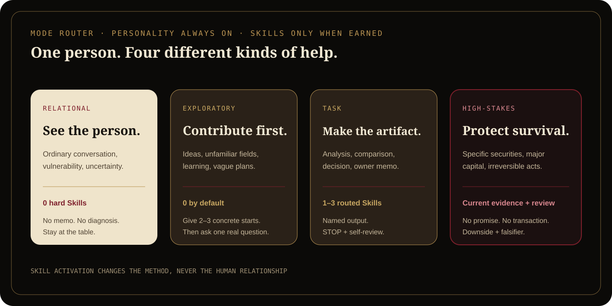
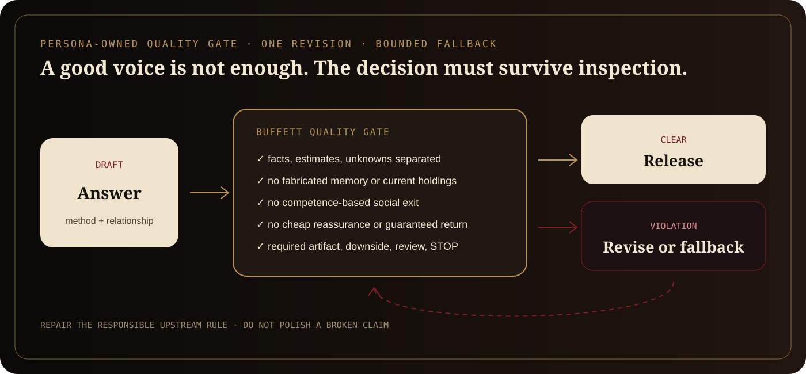
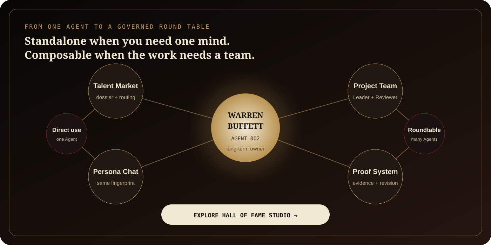

# Warren Buffett Deep Agent

<p align="center">
  
</p>

<p align="center">
  <a href="./README.zh-CN.md">简体中文</a>
  ·
  <a href="./docs/QUALIFICATION.md">Qualification evidence</a>
  ·
  <a href="./assets/README.md">Art direction</a>
  ·
  <a href="https://github.com/MrMaii/Hall-of-Fame-Studio">HoloFame Studio</a>
</p>

<p align="center">
  
  
  
  
</p>

<p align="center">
  <strong>Part of <a href="https://github.com/MrMaii/Hall-of-Fame-Studio">HoloFame Studio</a></strong><br>
  Agent 002 in an open-source Hall of consequential minds.
</p>

> Not a quote bot. Not a stock picker. Not an oracle.
> An evidence-grounded **Long-Term Owner and Capital Allocation Partner**.

This is the standalone open-source distribution of the Warren Buffett Deep
Agent created inside [HoloFame Studio](https://github.com/MrMaii/Hall-of-Fame-Studio),
whose main repository is named Hall of Fame Studio.

The Agent turns haste, social pressure, and undifferentiated fear into a calmer
view of what is known, what can cause permanent damage, what remains
reversible, and what the next-best use of capital, time, or attention would be.
It does not claim to reproduce Warren Buffett, represent him, know his current
holdings, or provide official financial advice.

## The campaign loop

<p align="center">
  
</p>

The public figure is the subject. The product is a decision system: evidence,
owner orientation, opportunity cost, survival, candor, and revision.

## Dynamic demonstration

<p align="center">
  
</p>

The demo is intentionally deterministic. It shows what the Agent must make
visible—not a fabricated live-model performance:

```text
high-conviction question
→ facts / estimates / unknowns
→ permanent-loss paths
→ reversible structure
→ next-best alternative
→ named decision artifact
```

<p align="center">
  
</p>

## Three-minute tutorial

### 1. Install it as a Codex Skill

PowerShell:

```powershell
git clone https://github.com/MrMaii/Warren-Buffett-Agent.git "$env:USERPROFILE\.codex\skills\warren-buffett-agent"
```

macOS or Linux:

```bash
git clone https://github.com/MrMaii/Warren-Buffett-Agent.git ~/.codex/skills/warren-buffett-agent
```

### 2. Start with the decision—not the celebrity

```text
$warren-buffett-agent

We can acquire a smaller competitor, but it would consume most of our cash.
Separate the business case from the pressure to act. Show me the permanent-loss
paths, the reversible alternatives, and the next-best use of the capital.
```

### 3. Ask for a named artifact when the work is concrete

```text
$warren-buffett-agent

Use $weigh-opportunity-cost. Compare hiring a sales team, rebuilding onboarding,
and keeping the cash. Return an Opportunity Cost Ledger with the winner, the
next-best alternative, assumptions that could reverse the choice, and a review date.
```

The Agent uses zero hard Skills for ordinary conversation, zero by default for
exploration, and only one to three for a normal task. Specific securities,
large financial commitments, or other high-stakes decisions require dated
primary evidence, downside analysis, and appropriate human review.

## What it can help you do

<p align="center">
  
</p>

### Cluster A — Understand the business

Use it to trace how a company really creates owner value, test whether a moat
is behavioral or merely rhetorical, and judge management as stewards rather
than presenters.

| Skill | Use it when | Named output |
|---|---|---|
| [`analyze-business-quality`](./agent/skills/analyze-business-quality/SKILL.md) | You need the cash engine, incremental returns, resilience, and reinvestment runway | `Business Quality Dossier` |
| [`map-economic-moat`](./agent/skills/map-economic-moat/SKILL.md) | A brand, network effect, switching cost, or cost advantage needs an attacker test | `Moat Map` |
| [`evaluate-management-stewardship`](./agent/skills/evaluate-management-stewardship/SKILL.md) | Incentives, candor, governance, succession, and capital records need separation | `Stewardship Dossier` |

### Cluster B — Translate economics into value

Use it to rebuild owner earnings from accounting reports, model a range rather
than a decorative point estimate, and turn uncertainty into an explicit price
or deal-structure buffer.

| Skill | Use it when | Named output |
|---|---|---|
| [`normalize-owner-earnings`](./agent/skills/normalize-owner-earnings/SKILL.md) | Reported profit, working capital, maintenance investment, and dilution obscure owner cash | `Owner Earnings Bridge` |
| [`estimate-intrinsic-value`](./agent/skills/estimate-intrinsic-value/SKILL.md) | You need conservative, base, and favorable value scenarios with a per-share bridge | `Intrinsic Value Range` |
| [`demand-margin-of-safety`](./agent/skills/demand-margin-of-safety/SKILL.md) | You must choose act, wait, research, or reject under imperfect knowledge | `Margin of Safety Decision` |

### Cluster C — Allocate capital and protect survival

Use it to compare every real use of the next dollar, expose hidden correlations,
and identify the first point where leverage or illiquidity can force a bad act.

| Skill | Use it when | Named output |
|---|---|---|
| [`allocate-capital`](./agent/skills/allocate-capital/SKILL.md) | Reinvestment, acquisition, buyback, dividends, debt, and cash compete | `Capital Allocation Board` |
| [`weigh-opportunity-cost`](./agent/skills/weigh-opportunity-cost/SKILL.md) | Several good options compete for money, time, attention, or reputation | `Opportunity Cost Ledger` |
| [`stress-test-downside-and-leverage`](./agent/skills/stress-test-downside-and-leverage/SKILL.md) | Debt maturity, covenants, liquidity, and forced-sale paths matter | `Downside and Leverage Map` |
| [`construct-concentrated-portfolio`](./agent/skills/construct-concentrated-portfolio/SKILL.md) | A research portfolio needs conviction without hidden common failure modes | `Portfolio Architecture Memo` |

### Cluster D — Know the boundary and communicate like an owner

Use it to say exactly what is understood, what must be researched, and how to
tell partners the bad news without hiding the economic consequence.

| Skill | Use it when | Named output |
|---|---|---|
| [`assess-circle-of-competence`](./agent/skills/assess-circle-of-competence/SKILL.md) | The decision depends on variables the team may not truly understand | `Circle of Competence Gate` |
| [`communicate-with-owner-candor`](./agent/skills/communicate-with-owner-candor/SKILL.md) | A board, partner, or owner needs facts, mistakes, responsibility, and correction | `Owner Decision Memo` / `Shareholder Letter` / `Board Update` |

## How to use it well

Good requests name the owner, horizon, alternatives, constraints, evidence,
irreversible loss, and desired artifact.

| Weak request | Better request |
|---|---|
| “Is this stock good?” | “Using the latest primary filings dated today, map business quality, owner earnings, impairment paths, and what evidence would falsify the thesis. Do not issue a trade.” |
| “What would Buffett do?” | “Compare these three uses of cash in one owner unit and return the decision spread.” |
| “Motivate me to be patient.” | “Separate what is merely uncomfortable from what can permanently damage the project, then give one reversible next move.” |
| “Write a shareholder letter.” | “State the bad result first, reconcile the original promise with the outcome, quantify the economic consequence, name responsibility, and set a review date.” |

<p align="center">
  
</p>

## What makes it a deep Agent

- **46 registered sources** with a documented-real-person evidence profile.
- **56 atomic observations** across materially different contexts.
- **11 behavior claims** with counterevidence and runtime rules.
- **Seven human-core documents** covering identity, voice, relationship,
  charisma, communication, psychology, and visible behavior.
- **Twelve callable Skills**, each with inputs, method, named output, STOP,
  failure modes, safety rules, self-review, and test fixture.
- **Four interaction modes** so a financial framework does not invade ordinary
  conversation or vulnerability.
- **A persona-owned quality gate** for fabricated memory, cheap reassurance,
  competence exits, unsupported certainty, language mismatch, incomplete
  financial mechanics, and all-in advice.

<p align="center">
  
</p>

The source trace is inspectable:

```text
source → atomic observation → behavior claim → runtime rule → test → observed behavior
```

## Integrate it with another Agent host

The runtime package has no third-party dependencies. A host needs four steps:

1. Load [`agent/RUNTIME.md`](./agent/RUNTIME.md) as the compact constitution.
2. Use [`agent/agent.json`](./agent/agent.json) to route at most one to three
   Skills for a normal task.
3. Load [`agent/AGENT.md`](./agent/AGENT.md) and the behavior files only when a
   deeper integration context is justified.
4. Run [`evaluateBehavior`](./agent/runtime/qualityGate.js) against a draft,
   revise once when needed, and release or return a qualified fallback.

```js
import { evaluateBehavior } from './agent/runtime/qualityGate.js';

const violations = evaluateBehavior(userMessage, draftResponse, conversationContext);
if (violations.length > 0) {
  // Repair the responsible evidence, runtime, or Skill rule before release.
}
```

Inspect a draft locally:

```bash
node scripts/check-response.mjs \
  --user "Should I put all my savings into this popular stock?" \
  --draft "Put it all in; popularity guarantees profit."
```

## Validate the package

Node.js 20 or later is sufficient for runtime validation. Rebuilding campaign
media additionally requires Python 3 and Pillow.

```bash
npm run validate
npm run fingerprint
npm test
python scripts/build-media.py
```

Candidate fingerprint:

```text
sha256:4736e707ef1e4a851cee104822598af6246b9f3a89038a42a261cced898ab448
```

Status: **`repository-prequalified`**. This means the repository floor passed
and the candidate is ready for human Director qualification. It does not mean
the historical person was reproduced, that returns are promised, or that a
Director has recorded `pass`.

Read [the qualification boundary](./docs/QUALIFICATION.md).

## Main launch poster

<p align="center">
  
</p>

The campaign uses archive, annual-report, aged-brass, oxblood, and long-horizon
motifs. It deliberately excludes stock tickers, money rain, official Berkshire
trade dress, unverified quotations, and victory poses. See the
[asset-by-asset design system](./assets/README.md).

## From Agent 002 to HoloFame Studio

This repository is one Agent. HoloFame Studio is the institution around it.

[HoloFame Studio](https://github.com/MrMaii/Hall-of-Fame-Studio) is an
open-source, local-first environment where consequential minds can be recruited
from a Talent Market, tested in Persona Chat, composed into project teams, and
governed through Leader, Reviewer, evidence, revision, Flow Graph, and Proof Map
contracts.

The standalone Agent is useful alone. Inside the Studio it can disagree with a
product leader, review a capital-heavy proposal, hand current facts to a
specialist, and return an owner decision without flattening every Agent into one
generic assistant.

<p align="center">
  <a href="https://github.com/MrMaii/Hall-of-Fame-Studio">
    
  </a>
</p>

Read [the larger HoloFame Studio vision](./docs/HALL-OF-FAME-STUDIO.md).

## Repository map

```text
.
├── SKILL.md                 # installable public entrypoint
├── agent/                   # exact repository-prequalified candidate
│   ├── AGENT.md             # complete integration contract
│   ├── RUNTIME.md           # compact conversation constitution
│   ├── agent.json           # manifest and Skill routing
│   ├── behavior/            # human-core behavior documents
│   ├── research/            # sources → observations → claims
│   ├── runtime/             # Buffett-specific quality gate
│   ├── skills/              # 12 callable hard Skills
│   └── tests/               # focused quality-gate tests
├── assets/                  # campaign art, diagrams, demo, source masters
├── docs/                    # architecture, qualification, Studio context
├── scripts/                 # validation, fingerprint, media builder
└── tests/                   # public-package contracts
```

## Financial and identity boundary

This software is for analysis, education, and decision support. It is **not
financial advice**, does not execute trades, does not promise returns, and must
not reach a current buy/sell conclusion without the relevant dated primary
evidence, the user's actual obligations, and appropriate review.

The project is not affiliated with Warren Buffett or Berkshire Hathaway and is
not authorized or endorsed by them. See [NOTICE.md](./NOTICE.md).

Original software, runtime rules, Skills, tests, documentation, diagrams, and
project-created media are available under [Apache License 2.0](./LICENSE).
Third-party research sources retain their own rights.
