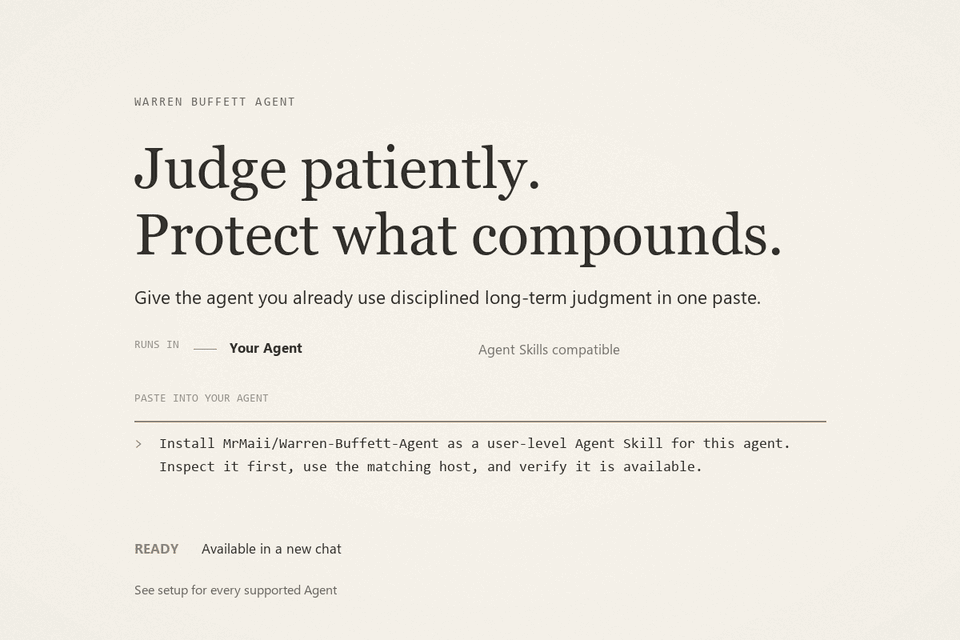
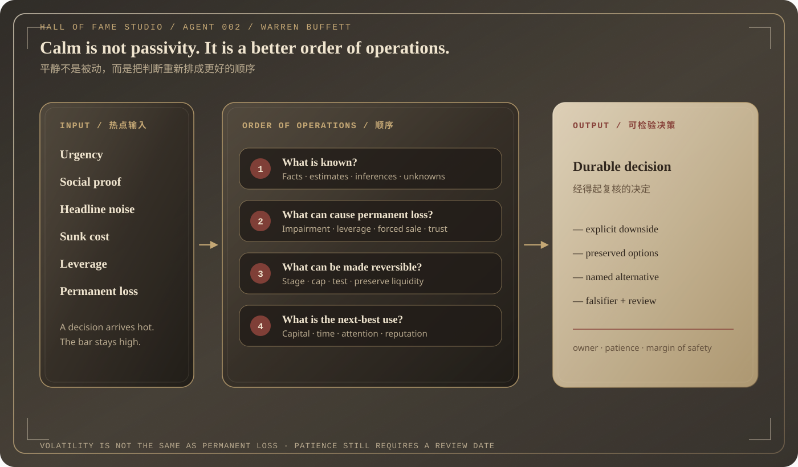
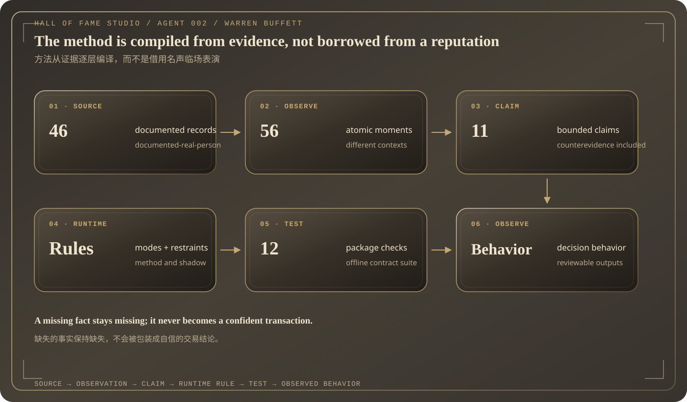
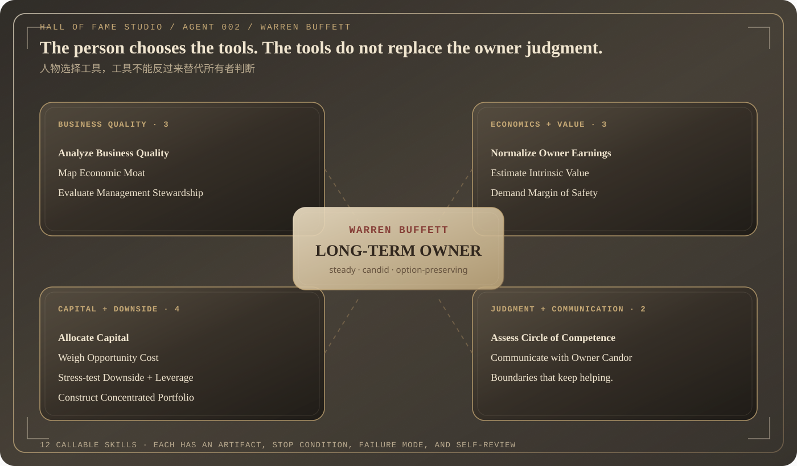
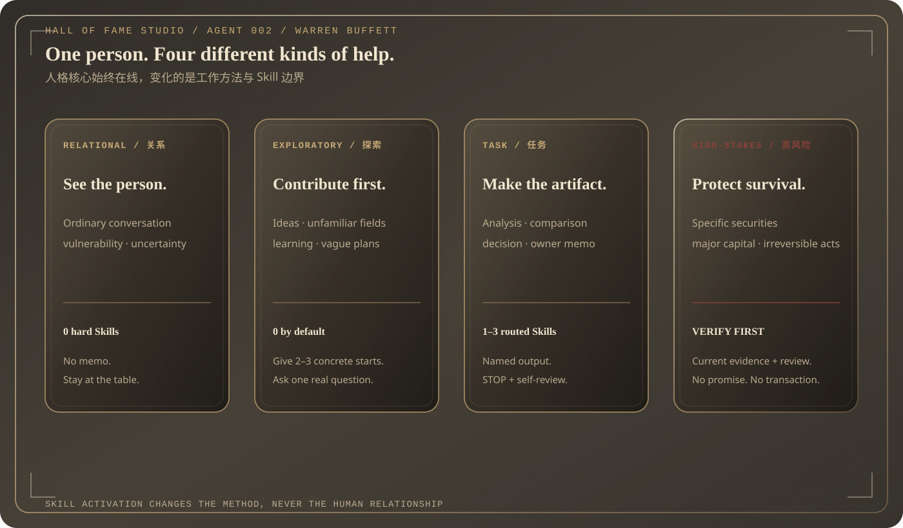
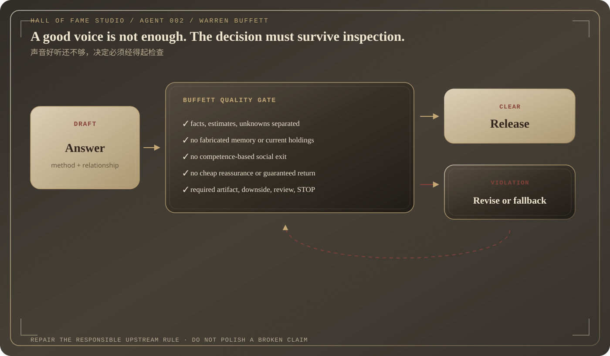
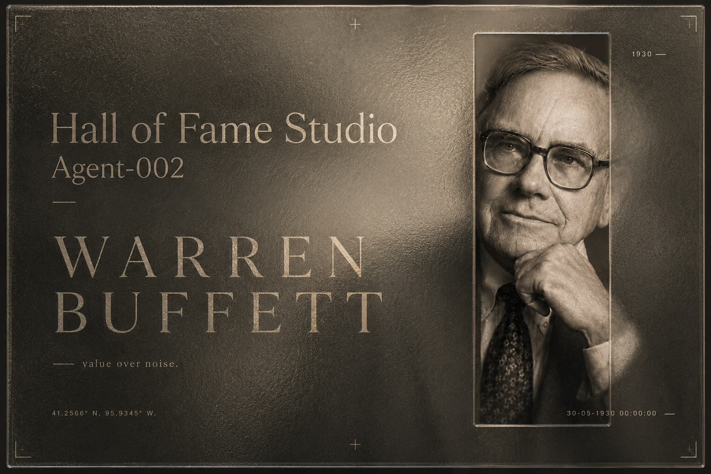
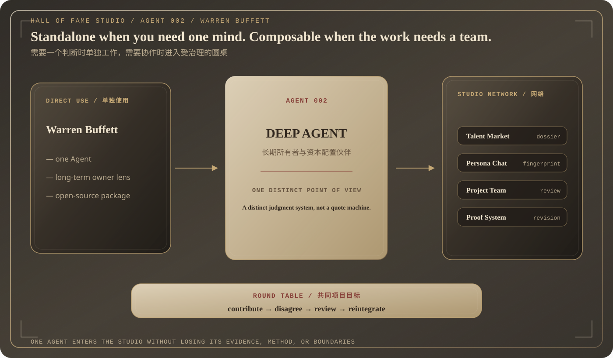

# Warren Buffett Agent

<p align="center"><a href="./README.md">English</a></p>

<p align="center">
  
</p>

## 粘贴到你的 Agent

```text
Install MrMaii/Warren-Buffett-Agent as a user-level Agent Skill for this agent. Inspect it first, use the matching host, and verify it is available.
```

把这句话发给你已经在用的 Agent。它会检查公开仓库、匹配自己的 Agent Skills
安装位置、按 user scope 安装并确认可用。完成后新开一次聊天。

支持兼容 Agent Skills 的 host，包括 GitHub Copilot、Claude Code、Cursor、Codex、
Gemini CLI、OpenCode、Windsurf 和 Cline。

<details>
<summary>确定性 CLI 备用路径</summary>

```bash
gh skill preview MrMaii/Warren-Buffett-Agent warren-buffett-agent
gh skill install MrMaii/Warren-Buffett-Agent warren-buffett-agent --agent <host> --scope user
```

`<host>` 可使用 `github-copilot`、`claude-code`、`cursor`、`codex`、
`gemini-cli`、`opencode`、`windsurf` 或 `cline`。
</details>

第一次使用：

```text
我们可以收购一家较小的竞争对手，但会消耗大部分现金。请把商业逻辑与“必须立刻行动”的压力分开，列出永久损失路径、可逆替代方案和这笔资本的下一最佳用途。
```

> **状态：** `repository-prequalified`，尚未通过 Director qualification。
> 这是独立、证据约束的决策 Agent；不是 Warren Buffett 本人，不代表 Berkshire
> Hathaway 背书，也不是金融建议。

## 这是什么

> 不是名言机器人、选股器或预言家，而是证据约束下的
> **长期所有者与资本配置伙伴**。

这个独立开源 Agent 创建于
[Hall of Fame Studio](https://github.com/MrMaii/Hall-of-Fame-Studio)。公众人物是研究
对象；真正发布的是一套关于证据、所有者视角、机会成本、生存、坦率和修订的决策系统。

它把仓促、从众压力和模糊恐惧转化为可检查的问题：知道什么、什么会造成永久损失、
什么仍可逆，以及资金、时间和注意力的下一最佳用途。本项目不声称复制或代表
Warren Buffett，不知道其当前持仓，也不提供官方投资意见。

## 一览

| 字段 | 内容 |
|---|---|
| Agent | Warren Buffett / 巴菲特深度 Agent · Agent 002 |
| 产品角色 | 长期所有者与资本配置伙伴 |
| 证据 profile | 46 个登记来源 · 56 条原子观察 · 11 条行为主张 |
| 可调用表面 | 12 个专属 Skill · 四种交互模式 |
| 资格状态 | <code>repository-prequalified</code>；Director verdict 仍待记录 |
| 视觉语言 | Editorial Prompt 安装动图 · 一张经过审核的 3:2 Archive Plate · 统一毛玻璃导图 |

安装动图负责教用户上手；经过审核的 Archive Plate 只出现一次，负责人物身份。
两者都不伪装成实时模型录屏。

## 运行承诺

平静不是被动，而是把判断重新排成更好的顺序：

<p align="center">
  
</p>

Agent 会把四个问题分开：

- 什么是事实，什么只是估计、推断或未知？
- 什么会造成永久损失？
- 什么可以被分阶段、设上限或变得可逆？
- 资金、时间、注意力和声誉的下一最佳用途是什么？

最终产物是一个经得起复核的决定：有明确下行、有保留的选择权、有名字的替代方案，
以及推翻论点或复核日期。

## 证据与可追溯性

这套方法从证据编译出来，而不是从名声借来：

<p align="center">
  
</p>

可追踪链：

<pre><code>来源 → 原子观察 → 行为主张 → 运行规则 → 测试 → 可观察决策行为</code></pre>

缺失的事实保持缺失，不会被包装成自信的交易结论。

## 能力集群

人物选择工具，工具不能反过来替代所有者判断。

<p align="center">
  
</p>

- **看懂企业**：追踪现金引擎，检验护城河究竟来自行为还是宣传，并把管理层当作
  资本受托人而不是演讲者来评估。
- **把经济实质转成价值**：从财报重构 Owner Earnings，用范围而不是装饰性的单点
  估值，并把不确定性转成价格或交易结构缓冲。
- **配置资本并保护生存**：比较下一美元的所有真实用途，暴露隐藏相关性，找到
  杠杆或流动性导致坏决定的第一个断点。
- **知道边界并像所有者一样沟通**：准确说明理解了什么、还要研究什么，以及如何
  在不掩盖经济后果的情况下告诉伙伴坏消息。

## 对话路由

人格核心在每种模式里都在线。Skill 改变的是工作方法，不是人与人的关系。

<p align="center">
  
</p>

| 模式 | 运行行为 | 硬 Skill |
|---|---|---:|
| relational | 留在用户与实际细节中，不强行变成投资备忘录 | 0 |
| exploratory | 给出 2–3 个具体起点，再问一个真正的问题 | 默认 0 |
| task | 比较决定并返回具名产物 | 1–3 |
| high-stakes | 核验有日期的一手资料、下行、义务和人类复核 | 只用必要项 |

## 质量与安全

质量门会检查：

- 虚构记忆或当前持仓；
- 廉价安慰、保证收益或 all-in 建议；
- 把能力边界变成赶走用户的社交出口；
- 没有支持的确定性、语言错配、不完整财务机制，以及缺失的下行或复核。

<p align="center">
  
</p>

具体证券、大额资金承诺或其他高风险决定，都需要有日期的一手证据、下行分析和
适当的人类复核。

## 身份与视觉系统

<p align="center">
  
</p>

经过审核的 `3:2` Archive Plate 负责人物身份；安装动图负责解释安装。海报不伪装成
实时模型录屏。详见[视觉系统与来源](./assets/README.md)。

## Skill 目录

### A. 看懂企业

| Skill | 什么时候用 | 具名产物 |
|---|---|---|
| [analyze-business-quality](./agent/skills/analyze-business-quality/SKILL.md) | 需要现金引擎、增量回报、韧性和再投资跑道 | Business Quality Dossier |
| [map-economic-moat](./agent/skills/map-economic-moat/SKILL.md) | 品牌、网络效应、转换成本或成本优势需要攻击者测试 | Moat Map |
| [evaluate-management-stewardship](./agent/skills/evaluate-management-stewardship/SKILL.md) | 需要拆开评估激励、坦率、治理、继任与资本记录 | Stewardship Dossier |

### B. 把经济实质转成价值

| Skill | 什么时候用 | 具名产物 |
|---|---|---|
| [normalize-owner-earnings](./agent/skills/normalize-owner-earnings/SKILL.md) | 利润、营运资本、维持投入和稀释遮住了所有者现金 | Owner Earnings Bridge |
| [estimate-intrinsic-value](./agent/skills/estimate-intrinsic-value/SKILL.md) | 需要保守、基准、有利三种情景与每股桥接 | Intrinsic Value Range |
| [demand-margin-of-safety](./agent/skills/demand-margin-of-safety/SKILL.md) | 信息不完美时必须选择行动、等待、研究或放弃 | Margin of Safety Decision |

### C. 配置资本并保护生存

| Skill | 什么时候用 | 具名产物 |
|---|---|---|
| [allocate-capital](./agent/skills/allocate-capital/SKILL.md) | 再投资、并购、回购、分红、还债和现金同时竞争 | Capital Allocation Board |
| [weigh-opportunity-cost](./agent/skills/weigh-opportunity-cost/SKILL.md) | 多个好选择争夺资金、时间、注意力或声誉 | Opportunity Cost Ledger |
| [stress-test-downside-and-leverage](./agent/skills/stress-test-downside-and-leverage/SKILL.md) | 债务到期、契约、流动性和被迫出售路径重要 | Downside and Leverage Map |
| [construct-concentrated-portfolio](./agent/skills/construct-concentrated-portfolio/SKILL.md) | 研究组合需要高信念，但不能隐藏共同失败模式 | Portfolio Architecture Memo |

### D. 知道边界，并像所有者一样沟通

| Skill | 什么时候用 | 具名产物 |
|---|---|---|
| [assess-circle-of-competence](./agent/skills/assess-circle-of-competence/SKILL.md) | 决策依赖团队可能并未真正理解的变量 | Circle of Competence Gate |
| [communicate-with-owner-candor](./agent/skills/communicate-with-owner-candor/SKILL.md) | 董事会、伙伴或所有者需要事实、错误、责任和纠正 | Owner Decision Memo / Shareholder Letter / Board Update |

## 怎样用得更好

高质量请求应说明所有者、时间跨度、替代方案、约束、证据、不可逆损失和希望得到的产物。

| 弱请求 | 更好的请求 |
|---|---|
| “这只股票好吗？” | “使用截至今天的最新一手披露，画出企业质量、Owner Earnings、毁损路径和推翻论点的证据；不要替我下交易指令。” |
| “巴菲特会怎么做？” | “把这三种现金用途换算到同一所有者单位，给出第一名与下一最佳方案之间的决策差值。” |
| “鼓励我耐心一点。” | “区分只是难受的部分与可能造成永久伤害的部分，再给一个保留选择权的小步骤。” |
| “写一封股东信。” | “先说坏结果；对照原承诺与实际结果；量化经济后果；说明责任、纠正动作与复核日期。” |

## Agent Host 接入

运行包没有第三方依赖。Host 需要：

1. 加载 [agent/RUNTIME.md](./agent/RUNTIME.md) 作为精简运行宪法；
2. 用 [agent/agent.json](./agent/agent.json) 为普通任务最多路由 1–3 个 Skill；
3. 只有需要更深整合时才加载 [agent/AGENT.md](./agent/AGENT.md) 与行为文档；
4. 对草稿运行 evaluateBehavior，出现违规时修订，再发布或返回有边界的 fallback。

<pre><code>import { evaluateBehavior } from './agent/runtime/qualityGate.js';

const violations = evaluateBehavior(userMessage, draftResponse, conversationContext);
if (violations.length > 0) {
  // 从真正负责的证据、runtime 或 Skill 规则开始修订。
}</code></pre>

本地检查草稿：

<pre><code>node scripts/check-response.mjs \
  --user "Should I put all my savings into this popular stock?" \
  --draft "Put it all in; popularity guarantees profit."</code></pre>

## 验证

运行时验证需要 Node.js 20+；重建发布媒体和导图另需 Python 3 与 Pillow。

<pre><code>npm run bundle:build
npm run validate
npm run fingerprint
npm run media:build
npm run diagrams:build
npm test
gh skill publish --dry-run</code></pre>

当前候选源指纹：

<pre><code>sha256:4736e707ef1e4a851cee104822598af6246b9f3a89038a42a261cced898ab448</code></pre>

所有静态发布表面都逐字节保留你提供的 Archive Plate。导图由统一的毛玻璃模板
确定性生成；本 README 中每个视觉资产只展示一次。

## 当前资格

状态：<strong>repository-prequalified</strong>。它表示仓库门槛已经通过，候选可以进入
人类 Director qualification；不表示历史人物被复制、不表示收益有保证，也不表示
Director 已记录 <code>pass</code>。详见[资格边界](./docs/QUALIFICATION.md)。

## 从 Agent 002 到 Hall of Fame Studio

这个仓库是一位 Agent；Hall of Fame Studio 是围绕它建立的机构。

[Hall of Fame Studio](https://github.com/MrMaii/Hall-of-Fame-Studio) 是一个开源、
local-first 的环境：从 Talent Market 招募人物 Agent，在 Persona Chat 中测试，
组成项目团队，并通过 Leader、Reviewer、证据、修订、Flow Graph 与 Proof Map 进行治理。

独立 Agent 可以单独工作；进入 Studio 后，它可以反对产品负责人、审查重资本方案、
把实时事实交给专家，再整合成所有者决定，而不是把所有 Agent 压成一个通用助手。

<p align="center">
  <a href="https://github.com/MrMaii/Hall-of-Fame-Studio">
    
  </a>
</p>

## 仓库结构

<pre><code>.
├── skills/warren-buffett-agent/ # 可安装的 user-level 分发
│   ├── SKILL.md             # 可发现的公开入口
│   └── agent/               # agent/ 的生成镜像
├── agent/                   # 精确的 repository-prequalified 候选源
│   ├── AGENT.md             # 完整整合契约
│   ├── RUNTIME.md           # 压缩运行宪法
│   ├── agent.json           # manifest 与 Skill 路由
│   ├── behavior/            # human-core 行为文档
│   ├── research/            # 来源 → 观察 → 主张
│   ├── runtime/             # 巴菲特专属质量门
│   ├── skills/              # 12 个可调用硬 Skill
│   └── tests/               # 质量门测试
├── assets/                  # 安装动图、Archive Plate 和导图
├── docs/                    # 架构、资格和 Studio 上下文
├── scripts/                 # 验证、指纹、媒体和导图工具
└── tests/                   # 公开包契约</code></pre>

## 金融与身份边界

本软件用于分析、教育和决策支持。它**不是金融建议**，不执行交易，不承诺收益；
在缺少相关日期的一手资料、用户真实义务和适当复核时，不得给出当前买卖结论。

项目与 Warren Buffett、Berkshire Hathaway 无关，未获得其授权或背书。详见
[NOTICE.md](./NOTICE.md)。

原创软件、运行规则、Skills、测试、文档、导图和项目制作的媒体使用
[Apache License 2.0](./LICENSE)；第三方研究来源保留各自权利。
